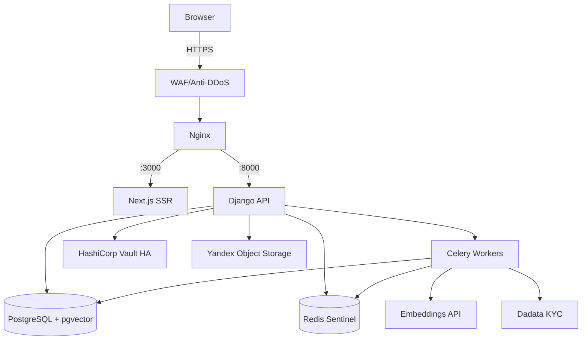

# Архитектурный аудит: PromptSpace v1.0
## Отчёт по улучшению и доработке документации

> **Статус:** Аудит завершён
> **Версия документа:** promptspace-v4.md (Release Candidate v1.0)
> **Дата аудита:** 2026-02-26
> **Методология:** Системный архитектурный обзор — структурная полнота, операционная готовность, безопасность, 152-ФЗ комплаенс

---

## Краткое резюме

Документ демонстрирует высокую зрелость: пройден путь от v0.1 до v1.0 с устранением ключевых архитектурных развилок (единый KMS, JWT blacklist, пагинация поиска). Тем не менее статус **Release Candidate** означает готовность к передаче в разработку — а ряд критических разделов остаётся либо отсутствующим, либо слишком тонким для производственного документа.

**Итоговая оценка готовности: 68/100** — к разработке условно не готов без устранения блокирующих проблем.

| Категория | Оценка | Комментарий |
|-----------|--------|-------------|
| Функциональная полнота | 75% | Ключевые flows описаны, много деталей отсутствует |
| Операционная готовность | 55% | Тестирование, DR, мониторинг — сырые разделы |
| Безопасность | 70% | Хорошая база, но несколько непроработанных векторов |
| Комплаенс 152-ФЗ | 65% | Ключевые пункты есть, но не полностью |
| Разработческая пригодность | 60% | Недостаточно деталей для старта без многочисленных уточнений |

---

## Часть I: Блокирующие проблемы (Critical — до старта разработки)

Следующие пробелы **заблокируют команду** в первые же дни. Устранить до начала спринта.

### [BLK-1] Архитектурная диаграмма полностью отсутствует

**Раздел:** 8.1
**Проблема:** Топология описана текстом — три строки. Разработчик, DevOps и новый участник команды не могут получить системную картину без визуализации. Для документа такого охвата это самый дорогой пробел.

**Требуется минимум:**
- C4 Container Diagram (Mermaid/PlantUML достаточно)
- Data flow: покупка, загрузка промпта, аутентификация через OAuth
- Network topology: WAF → Nginx → сервисы, сегментация

**Пример минимальной C4-диаграммы (вставить в раздел 8.1):**


---

### [BLK-2] Раздел «Тестирование» — одна строка (раздел 15)

**Проблема:** `Unit: pytest, coverage ≥80%... E2E: Playwright` — это заголовок, не документация. Для финансовой платформы с шифрованием и платёжным процессингом это недопустимо.

**Требуется:**
- Какие компоненты покрываются unit / integration / e2e
- Обязательные E2E-сценарии (покупка, KYC, right-to-erasure)
- Как тестируются интеграции с Vault, Robokassa, Dadata (sandbox, VCR-cassettes, моки)
- Security-тестирование: SAST (Bandit/Semgrep), dependency scan (pip-audit)
- Нагрузочное тестирование: инструмент (Locust/k6), сценарии, пороговые значения
- Критические пути с покрытием 100%: шифрование/расшифровка, anonymize_account, KYC lifecycle

---

### [BLK-3] ADR-001..011 существуют только как строки в списке

**Раздел:** 14
**Проблема:** 11 из 14 ADR — пустые названия. Реализованы только ADR-012, ADR-013, ADR-014.

**Критические ADR без контента:**

| ADR | Название | Почему критично |
|-----|----------|-----------------|
| ADR-001 | Zero Trust KMS | Ключевое архитектурное решение |
| ADR-002 | pgvector | Обоснование выбора вместо Qdrant |
| ADR-006 | Celery+Redis | Брокер — критичная зависимость |
| ADR-008 | Email+Unisender+fallback OTP | OTP — единственный путь входа по email |
| ADR-010 | Backup pgBackRest | RPO=5мин зависит от этого |

---

### [BLK-4] Модели данных описаны неполно (раздел 9)

**Проблема:** Для Django-проекта документ не даёт достаточно информации для написания `models.py`.

| Модель | Отсутствующие поля / детали |
|--------|-----------------------------|
| `SellerProfile` | Ни одно поле не перечислено (ИНН, legal_type, kyc_status, kyc_rejection_reason, robokassa_merchant_id?) |
| `Prompt` | Нет: `price` (тип `DecimalField`? точность?), `variables`, `instruction`, `ai_model` (FK или CharField?), `rating_avg`, `rating_count`, `purchases_count` |
| `Review` | Нет диапазона rating (1–5? 1–10?), max_length для `text` |
| `Purchase` | `platform_commission` — процент или абсолютное значение? Тип данных? |
| `ModerationRecord` | Структура не определена вообще |
| `Notification` | Модели нет, а уведомления упомянуты ~15 раз по всему документу |
| — | Индексы БД (кроме HNSW) не определены |
| — | ERD или текстовое описание FK-связей отсутствует |

---

### [BLK-5] Критические endpoints отсутствуют в API Contract (раздел 10)

**Проблема:** API Contract не покрывает целые роли:

| Роль | Отсутствующие endpoints |
|------|------------------------|
| Moderator | Очередь на модерацию `GET /moderation/queue/`, `POST /moderation/{id}/approve/`, `POST /moderation/{id}/reject/` |
| Seller | KYC submission `POST /seller/kyc/`, профиль `GET/PATCH /seller/profile/`, аналитика `GET /seller/analytics/` |
| Superadmin | Ни один endpoint не описан (документ упоминает Django Admin — это нужно зафиксировать явно как дизайн-решение) |
| Any | Notifications settings `GET/PATCH /users/me/notifications/` |

Также отсутствует `sort` параметр в `GET /catalog/prompts`, хотя сортировка "по дате, рейтингу, цене" упомянута в разделе 6.

---

## Часть II: Высокоприоритетные проблемы (High — до первого релиза)

### [H-1] Безопасность: незащищённые векторы атак

#### H-1.1 Brute-force OTP — механизм блокировки не описан
**Раздел:** 5.1
Rate limiting 10r/m (ADR-009) не является достаточной защитой от distributed brute-force. Не определено: блокировать ли email после X неверных попыток, на какой TTL, и фиксировать ли в AuditLog.
**Рекомендация:** Зафиксировать — после 5 неверных кодов email блокируется на 15 минут; запись в AuditLog с IP.

#### H-1.2 Refresh Token Rotation не описана
**Раздел:** 5.2
При `POST /auth/refresh` — аннулируется ли старый Refresh Token? Если нет, утечка Refresh Token даёт бессрочный доступ до 7 дней.
**Рекомендация:** Явно зафиксировать схему: одноразовый refresh token (rotation) или многоразовый + Redis-blacklist.

#### H-1.3 XSS в prompt content
**Раздел:** 12.4 описывает escape для `Review` и `short_description`, но не для отображения самого текста промпта.
**Рекомендация:** Зафиксировать политику рендеринга: промпт отображается в `<pre>` (plain text), или с Markdown + DOMPurify sanitize.

#### H-1.4 Vault Unseal Strategy при рестарте
**Раздел:** 11.4
HashiCorp Vault при рестарте находится в sealed-состоянии. Стратегия unsealing не описана: Auto-unseal (via Yandex KMS Transit seal?)? Manual multi-key unseal?
**Риск:** Перезапуск Vault HA кластера = полная недоступность шифрования до ручного вмешательства DevOps.

#### H-1.5 Судьба промптов при удалении аккаунта продавца
**Раздел:** 2.5
Алгоритм анонимизации детально описывает `Purchase`, `PromptAccess`, `Review`, `AuditLog` — но ни слова о промптах продавца. Что происходит с PUBLISHED промптами удалённого продавца?
**Варианты (выбрать один и зафиксировать):**
- Промпты сохраняются (анонимный автор), покупатели сохраняют доступ
- Промпты переводятся в ARCHIVED, доступ покупателей сохраняется
- Промпты удаляются, PromptAccess отзывается (юридически рискованно)

---

### [H-2] Комплаенс 152-ФЗ: незакрытые обязательства

#### H-2.1 Оператор персональных данных не назван
Документ не называет юридическое лицо — Оператора ПДн, и не указывает на регистрацию в реестре Роскомнадзора. Это не техническая, а юридическая ответственность, но архитектура должна её отражать.

#### H-2.2 Соглашения с субпроцессорами (DPA)
Dadata, Yandex Cloud, Unisender, Robokassa — все обрабатывают ПДн пользователей. 152-ФЗ требует договора с каждым обработчиком ПДн. Документ не фиксирует факт наличия/отсутствия этих DPA.

#### H-2.3 SLA на DSR-запросы не определён
DSR-страница `/legal/dsr/` есть, но нет ни слова о том, кто обрабатывает запросы и в какие сроки. 152-ФЗ — 30 дней на ответ. Процесс обработки (manual? автоматизированный?) не описан.

#### H-2.4 Процедура уведомления об утечках
152-ФЗ (с 2022) требует уведомлять Роскомнадзор об утечках ПДн в течение 24 часов. Процесс и ответственный не описаны.

#### H-2.5 Cookie Banner — геолокация без контекста
Cookie-баннер упоминает сбор "IP, геолокации", но нигде в документе не описано: где хранится геолокация, с какой целью, какой retention.

---

### [H-3] Финансы: неполная модель

#### H-3.1 Комиссионная ставка не зафиксирована
**Раздел:** 3.3 — "Размер — через Django Admin". Это механизм изменения, не начальное значение. Разработчик не знает, как инициализировать систему (Django fixture? миграция?).
**Рекомендация:** Зафиксировать дефолт (например, 20%) и допустимый диапазон (0–50%).

#### H-3.2 Refund Flow: отсутствует идемпотентность и callback
**Раздел:** 3.4
Не описано:
- Как Robokassa уведомляет о выполненном возврате (webhook? polling?)
- Защита от двойного возврата (идемпотентность Celery-задачи `process_refund`)
- Что происходит с комиссией платформы при возврате
- Таймаут/SLA на возврат средств покупателю

#### H-3.3 Инициирование Refund через Robokassa API
Документ говорит "Superadmin инициирует возврат в Robokassa" — но не описывает технически: через Django Admin action? Через отдельный endpoint? Robokassa API endpoint для возврата?

---

### [H-4] Операционные риски без митигации

#### H-4.1 Vault Data Loss — самый критичный отсутствующий риск
**Раздел:** 21 — матрица рисков R1–R9
**Проблема:** Если KEK потерян безвозвратно — **все зашифрованные промпты недоступны навсегда**. Это не риск Severity: High — это Severity: **CRITICAL / Existential**.
**Требуется:**
- Vault snapshot strategy (частота, хранилище снапшотов, тест восстановления)
- Vault backup как R0 в матрице рисков с явной митигацией

#### H-4.2 RTO не зафиксирован
**Раздел:** 20 — "рекомендуется зафиксировать по согласованию с бизнесом". В Release Candidate это неприемлемо. Без RTO нельзя планировать инфраструктуру, дежурства, SLA с пользователями.
**Рекомендация:** Зафиксировать временные значения: RTO 4ч для PostgreSQL и Vault, RTO 1ч для Redis.

#### H-4.3 Disaster Recovery Plan отсутствует
RPO=5мин задан, но полный DR Plan отсутствует. Не описано:
- Процедура PostgreSQL failover (replica promotion)
- Процедура восстановления Redis
- Процедура восстановления Vault из снапшота
- Порядок действий при полном сбое хостинга (runbook упомянут, но его структура не определена)

---

## Часть III: Детальный анализ по разделам

### Раздел 1: Обзор продукта

| # | Замечание | Приоритет |
|---|-----------|-----------|
| 1.1 | Целевые бизнес-метрики отсутствуют (MAU, GMV, количество промптов к запуску) | Medium |
| 1.2 | "YandexGPT Embeddings **или аналог**" — неопределённость создаёт compliance риск 152-ФЗ; нужен явный список допустимых провайдеров | High |
| 1.3 | Uptime target не зафиксирован (99.5%? 99.9%?) | Medium |
| 1.4 | Валюта сделок (только RUB?) явно не зафиксирована | Low |

---

### Раздел 4: Ролевая модель

| # | Замечание | Приоритет |
|---|-----------|-----------|
| 4.1 | `UserRole` enum — список значений не перечислен явно в этом разделе | Medium |
| 4.2 | Onboarding flow продавца не описан (шаги от регистрации до первой публикации) | Medium |
| 4.3 | **Судьба PUBLISHED промптов при удалении аккаунта не определена** (BLK-связанный) | High |
| 4.4 | Управление сессиями (просмотр активных устройств, завершение конкретной сессии) не описано | Low |

---

### Раздел 5: Аутентификация

| # | Замечание | Приоритет |
|---|-----------|-----------|
| 5.1 | Раздел 5.5 "Восстановление доступа" — две строки; нет сценария "потерял доступ к email" | Medium |
| 5.2 | **Refresh token rotation** не описана | High |
| 5.3 | TOTP/2FA для Sellers и Superadmin не рассмотрен | Medium |
| 5.4 | Telegram OAuth: `auth_date` TTL не зафиксирован | Medium |
| 5.5 | "Вход под пользователем" (5.4): не описан выход из режима и что происходит с сессией | Low |
| 5.6 | OTP delivery: при недоступности Unisender — есть "fallback SMTP" (упомянут в 8.1), но не связан с OTP flow | Medium |

---

### Раздел 6: Каталог

| # | Замечание | Приоритет |
|---|-----------|-----------|
| 6.1 | **Параметр `sort` в `GET /catalog/prompts` отсутствует** в API Contract (разд. 10), хотя сортировка упомянута | High |
| 6.2 | Логика фильтров AND/OR не определена | Medium |
| 6.3 | Иерархия категорий (плоская/дерево) не определена | Medium |
| 6.4 | Теги: кто их создаёт — sellers? moderators? auto-generated? | Medium |
| 6.5 | Cold start: что показывается в каталоге при нулевых эмбеддингах? | Low |
| 6.6 | max_offset=1000 — 1000 результатов максимум; это бизнес-решение, стоит зафиксировать явно | Low |

---

### Раздел 7: Карточка промпта

| # | Замечание | Приоритет |
|---|-----------|-----------|
| 7.1 | ARCHIVED → ? переход обратно не определён (можно ли re-publish?) | Medium |
| 7.2 | **PENDING_PLAGIARISM_REVIEW resolve flow не описан**: модератор принимает решение → PUBLISHED или → REJECTED? | High |
| 7.3 | FAILED_SECURITY_SCAN: retry limit не установлен (infinite retries = abuse) | Medium |
| 7.4 | Какой LLM/AISP используется для SECURITY_SCAN? Стоимость на промпт? | Medium |
| 7.5 | Поле `variables` в ответе `/prompts/{id}/content/` — формат не определён | Medium |
| 7.6 | Preview для незарегистрированных: только `short_description`? Частичный показ текста? | Low |

---

### Раздел 8: Архитектура системы

| # | Замечание | Приоритет |
|---|-----------|-----------|
| 8.1 | **Архитектурная диаграмма отсутствует** (BLK-1) | Critical |
| 8.2 | Load Balancer при горизонтальном масштабировании не упомянут | Medium |
| 8.3 | Health check endpoints не определены (`/healthz`, `/readyz`) — нужны для Docker Healthcheck | Medium |
| 8.4 | PgBouncer / connection pooling не упомянут | Medium |
| 8.5 | Circuit breaker для внешних сервисов (Dadata, Unisender) не описан | Medium |
| 8.6 | CDN для статических ассетов Next.js не упомянут | Low |

---

### Раздел 9: Data Model

| # | Замечание | Приоритет |
|---|-----------|-----------|
| 9.1 | `SellerProfile` — поля не описаны вообще | Critical |
| 9.2 | `Prompt` — неполный список полей | Critical |
| 9.3 | `Review` — диапазон rating (1–5?) не определён | High |
| 9.4 | `Purchase.platform_commission` — тип данных не определён | High |
| 9.5 | `ModerationRecord` — структура не определена | High |
| 9.6 | `Notification` — модели нет, хотя уведомления упомянуты повсюду | High |
| 9.7 | Индексы БД (помимо HNSW) не определены | Medium |
| 9.8 | ERD или текстовое описание FK-связей отсутствует | Medium |
| 9.9 | Enum `KYCStatus` значения не перечислены в разделе 9 | Medium |

---

### Раздел 10: API Contract

| # | Замечание | Приоритет |
|---|-----------|-----------|
| 10.1 | `sort` параметр в `GET /catalog/prompts` отсутствует | High |
| 10.2 | **Endpoints модератора полностью отсутствуют** | Critical |
| 10.3 | **KYC submission endpoint отсутствует** | Critical |
| 10.4 | Seller profile endpoints отсутствуют | High |
| 10.5 | Response schemas не определены для большинства endpoints | High |
| 10.6 | Rate limit response headers не описаны (`Retry-After`, `X-RateLimit-*`) | Medium |
| 10.7 | Seller analytics endpoint отсутствует | Medium |
| 10.8 | Django Ninja генерирует OpenAPI автоматически — стоит зафиксировать URL `/api/v1/docs` | Low |

---

### Раздел 11: Интеграции

| # | Замечание | Приоритет |
|---|-----------|-----------|
| 11.1 | OAuth: что если провайдер не предоставляет email? | High |
| 11.2 | Dadata retry strategy не специфицирована (exponential backoff? max_retries=3?) | Medium |
| 11.3 | **Vault AppRole vs Token** — production рекомендация не дана; Token менее безопасен | High |
| 11.4 | **Vault auto-unseal strategy не описана** | High |
| 11.5 | **Vault backup strategy (snapshots) полностью отсутствует** | Critical |
| 11.6 | YOS bucket access policy (public/private разграничение) не описана | Medium |
| 11.7 | Presigned URL whitelist "публичных превью" — конкретные prefix'ы не перечислены | Medium |

---

### Раздел 12: Frontend

| # | Замечание | Приоритет |
|---|-----------|-----------|
| 12.1 | State management подход не определён (Zustand? Context API?) | Medium |
| 12.2 | Error Boundary strategy не описана | Medium |
| 12.3 | Routing: отсутствуют seller dashboard routes (`/seller/dashboard/`, `/seller/prompts/`), route `/register/` | High |
| 12.4 | Политика рендеринга prompt content: plain text vs markdown | High |
| 12.5 | Performance budget (CWV targets) не определён | Low |

---

### Раздел 15: Тестирование (требует переписывания)

Текущее содержимое: одна строка. Минимально необходимая структура:

```markdown
### 15.1 Unit Tests
- pytest, coverage ≥ 80% по всему коду
- Критические пути — 100%: шифрование/расшифровка DEK, anonymize_account, purchase flow
- Моки: HashiCorp Vault (VaultMock), Robokassa webhook, Dadata, Unisender, YOS

### 15.2 Integration Tests (pytest-django)
- Robokassa: sandbox credentials в .env.test
- Полный flow покупки: PENDING → webhook → SUCCESS → PromptAccess
- KYC lifecycle: submit → Dadata verify → VERIFIED → periodic check → REJECTED

### 15.3 E2E (Playwright) — обязательные сценарии
1. Регистрация + OTP + покупка + доступ к контенту
2. Seller: KYC → публикация → PUBLISHED
3. Модератор: approve / reject с причиной
4. Право на забвение: запрос → проверка анонимизации

### 15.4 Security Testing
- SAST: Bandit + Semgrep в CI pipeline
- Dependency scan: pip-audit в CI
- OWASP ZAP: ручной на staging перед production release

### 15.5 Load Testing (Locust/k6)
- 1000 concurrent catalog requests: p95 < 200ms
- 100 concurrent purchases: p95 < 2s
- 50 concurrent semantic searches: p95 < 500ms
```

---

### Раздел 17: SEO (одна строка — требует доработки)

| # | Отсутствует | Приоритет |
|---|-------------|-----------|
| 17.1 | sitemap.xml: стратегия динамической генерации (ISR? cron?) для `/prompt/{slug}/` | High |
| 17.2 | robots.txt конфигурация (что индексируем, что нет) | Medium |
| 17.3 | JSON-LD structured data для карточек промптов (Product schema) | Medium |
| 17.4 | Canonical URL стратегия (фильтры в каталоге = параметры URL) | Medium |
| 17.5 | `/blog/{slug}/` — в MVP или нет? Если нет — убрать из документа | Medium |

---

### Раздел 18: Инфраструктура и деплой

| # | Замечание | Приоритет |
|---|-----------|-----------|
| 18.1 | Secrets в CI/CD: список обязательных GitHub Secrets не определён | High |
| 18.2 | Image tagging strategy не определена (git sha? semver? оба?) | Medium |
| 18.3 | Rollback procedure при неудачном деплое не описана | High |
| 18.4 | "Manual approve" — через GitHub Environments? Кто имеет право approve? | Medium |
| 18.5 | Nginx SSL/TLS: termination point, cipher suites, HSTS не описаны | High |
| 18.6 | Celery worker queues не разделены (embeddings vs emails vs payments должны быть в отдельных очередях) | Medium |

---

### Раздел 19: Переменные окружения (список неполный)

Отсутствующие переменные:

```bash
# Django
DJANGO_SETTINGS_MODULE=config.settings.production
GUNICORN_WORKERS=4
GUNICORN_TIMEOUT=30

# Error tracking
SENTRY_DSN=

# AI Security scan
SECURITY_SCAN_PROVIDER=
SECURITY_SCAN_API_KEY=
SECURITY_SCAN_API_URL=

# Business
PLATFORM_COMMISSION_RATE=0.20
MAX_PROMPT_LENGTH=50000

# Celery
CELERY_BROKER_URL=         # отдельный Redis DB или тот же?
CELERY_CONCURRENCY=4

# Monitoring
ZABBIX_AGENT_HOST=
ZABBIX_SERVER=
```

Также нет пояснения: `VAULT_TOKEN` или `VAULT_ROLE` (AppRole) — что использовать в production? AppRole безопаснее.

---

### Раздел 20: Мониторинг

| # | Замечание | Приоритет |
|---|-----------|-----------|
| 20.1 | **RTO не зафиксирован** | Critical |
| 20.2 | Error tracking (Sentry или аналог) не упомянут | High |
| 20.3 | Бизнес-метрики для алертов отсутствуют (daily purchases, KYC conversion rate) | Medium |
| 20.4 | Log aggregation strategy не описана (stdout? ELK? Loki?) | Medium |
| 20.5 | On-call rotation и escalation policy не описаны | Medium |
| 20.6 | Нет алертов на: SECURITY_SCAN failure rate, plagiarism queue depth, KYC rejection spike | Medium |

---

### Раздел 21: Риски

| # | Замечание | Приоритет |
|---|-----------|-----------|
| 21.1 | **R0 "Vault data loss" полностью отсутствует** (Critical/Existential severity) | Critical |
| 21.2 | Вероятность не оценена — только severity | Medium |
| 21.3 | Владелец риска не назначен | Low |
| 21.4 | Отсутствующие риски: DDoS на semantic search (дорогая вычислительная операция), LLM provider outage (SECURITY_SCAN), массовая регистрация ботов, supply chain (зависимости) | High |
| 21.5 | R9 (path traversal) помечен Medium — должен быть High для финансовой платформы | Medium |

---

## Часть IV: Отсутствующие разделы

### [MISSING-1] Система уведомлений

Уведомления упоминаются ~15 раз по всему документу, но нет:
- Каталога всех типов уведомлений
- Каналов доставки (email? Telegram? оба?)
- Настроек opt-in/opt-out для пользователя
- Модели `Notification` в data model
- Шаблонов (хотя бы subject lines)

### [MISSING-2] File Upload Flow

Seller загружает примеры результатов (images), но flow не описан:
- Прямая загрузка через presigned PUT URL в YOS? Или через Django backend?
- Валидация MIME type на backend
- Сжатие/ресайз изображений?
- Лимит файлов на промпт (документ ограничивает 5 МБ на файл, но не количество)

### [MISSING-3] Seller Analytics Dashboard

Упомянут в 4.2, но не описан:
- Какие метрики: просмотры карточки, продажи, доход, конверсия?
- Период доступности данных
- Агрегация в БД (pre-computed) или real-time?

### [MISSING-4] CMS

Django Admin используется для: баннеров, комиссии, причин отклонения — но структура этих объектов не описана нигде.

### [MISSING-5] Blog

URL `/blog/{slug}/` в SEO-разделе. Это MVP? Если да — нужна модель `Post`. Если нет — убрать из документа. Двусмысленность недопустима.

---

## Часть V: Рекомендуемая структура доработки

### Новый раздел: «Безопасность» (консолидация)

Вопросы безопасности разбросаны по 6 разделам. Нужен сводный:

```markdown
## X. Политика безопасности

### X.1 OWASP Top 10: применимые контроли
### X.2 Управление секретами (Vault AppRole rotation, env vars в CI)
### X.3 HTTP Security Headers (CSP, HSTS, X-Frame-Options)
### X.4 CORS: staging vs production конфигурация
### X.5 Dependency scanning (pip-audit, npm audit в CI)
### X.6 Plan penetration testing
```

### Новый раздел: «Disaster Recovery»

```markdown
## X. Disaster Recovery

| Компонент | RPO | RTO | Процедура |
|-----------|-----|-----|-----------|
| PostgreSQL | 5 мин | 4 ч | pgBackRest restore + replica promotion |
| Redis | N/A (reconstruction) | 30 мин | restart + cache warmup |
| Vault | 0 (HA cluster) | 1 ч | unseal + snapshot restore |
| YOS | региональный SLA | N/A | —  |

### Процедура восстановления Vault из снапшота
1. ...
### Процедура PostgreSQL failover
1. ...
```

### Доработка ADR: минимальный шаблон для каждого

```markdown
**ADR-002: Использование pgvector для семантического поиска в MVP**
Status: Accepted
Context: Нужен векторный поиск для ~100k промптов на старте.
Decision: pgvector через ISearchProvider в MVP.
Options:
| | pgvector | Qdrant |
|---|---|---|
| Ops overhead | Низкий | Высокий (новый сервис) |
| Performance >1M | Деградирует | Оптимален |
Consequences: при >10M — перевод на Qdrant без изменений бизнес-логики.
Review date: при достижении 5M промптов.
```

---

## Часть VI: Сводная матрица замечаний

| ID | Раздел | Описание | Severity |
|----|--------|----------|----------|
| BLK-1 | 8.1 | Архитектурная диаграмма отсутствует | Critical |
| BLK-2 | 15 | Тестирование — одна строка | Critical |
| BLK-3 | 14 | ADR-001..011 без контента | Critical |
| BLK-4 | 9 | Модели данных неполные | Critical |
| BLK-5 | 10 | Endpoints модератора и KYC отсутствуют | Critical |
| H-1.2 | 5.2 | Refresh token rotation не описана | High |
| H-1.3 | 12 | XSS в prompt content | High |
| H-1.4 | 11.4 | Vault unseal strategy | High |
| H-1.5 | 2.5+4 | Судьба промптов при удалении аккаунта | High |
| H-2.1 | 2 | Оператор ПДн не назван | High |
| H-2.2 | 2 | DPA с субпроцессорами | High |
| H-2.4 | 2 | Breach notification process | High |
| H-3.1 | 3.3 | Комиссионная ставка без дефолта | High |
| H-3.2 | 3.4 | Refund: идемпотентность и callback | High |
| H-4.1 | 21 | R0: Vault data loss отсутствует | Critical |
| H-4.2 | 20 | RTO не зафиксирован | Critical |
| H-4.3 | — | DR Plan отсутствует | High |
| M-1 | 7 | PENDING_PLAGIARISM_REVIEW resolve flow | High |
| M-2 | 10 | sort parameter в catalog API | High |
| M-3 | 11 | Vault AppRole vs Token | High |
| M-4 | 11 | Vault backup strategy | Critical |
| — | — | Система уведомлений не описана | High |
| — | — | File upload flow не описан | High |
| — | — | Blog: MVP или нет — неопределённость | Medium |

**Итого: 24 замечания — Critical: 9, High: 13, Medium: 2**

---

## Часть VII: План доработки документации

### Спринт 0 (до старта разработки — блокирующее)

| # | Задача | Исполнитель | Раздел |
|---|--------|-------------|--------|
| 1 | Добавить Mermaid C4-диаграммы (Container + key data flows) | Архитектор | 8 |
| 2 | Полные поля всех моделей с типами (`SellerProfile`, `Prompt`, `Review`, `Purchase`, `Notification`) | Архитектор+Backend | 9 |
| 3 | Добавить endpoints: модератор, KYC, seller profile | Архитектор | 10 |
| 4 | Раскрыть ADR-001, 002, 006, 008, 010 по шаблону | Архитектор | 14 |
| 5 | Зафиксировать RTO; добавить DR Plan | Архитектор+DevOps | 20+new |
| 6 | Vault: unsealing strategy, AppRole, snapshot backup | DevOps | 11.4 |
| 7 | Определить судьбу промптов при удалении аккаунта | Архитектор+Legal | 2.5, 4 |

### Спринт 1 (параллельно с разработкой MVP)

| # | Задача | Раздел |
|---|--------|--------|
| 8 | Переписать раздел 15 (Тестирование) | 15 |
| 9 | Описать систему уведомлений (новый раздел + модель) | new + 9 |
| 10 | Описать File Upload Flow | 7 или 12 |
| 11 | Устранить compliance gaps (DPA, оператор, breach notification, geolocation) | 2 |
| 12 | Добавить консолидированный раздел «Безопасность» | new |
| 13 | Blog: подтвердить или убрать из MVP scope | 17, 12 |

### До Production Release

| # | Задача |
|---|--------|
| 14 | `docs/runbook.md` — полный (не шаблон) для всех алертов |
| 15 | Нагрузочное тестирование: результаты + capacity plan |
| 16 | Penetration testing отчёт |
| 17 | Vault backup: тест восстановления из снапшота |

---

*Архитектурный аудит подготовлен по документу promptspace-v4.md (v1.0, Release Candidate).*
*Следующая ревизия документа рекомендуется после устранения Спринта 0 (BLK-пунктов).*
